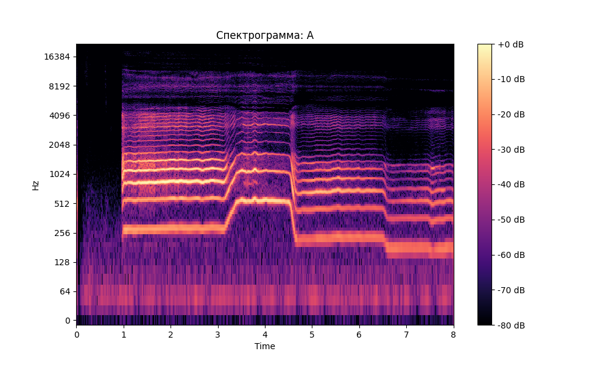
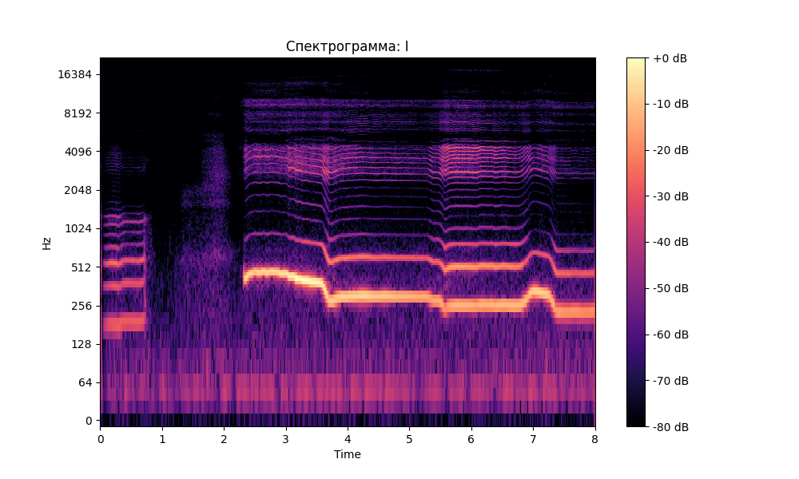
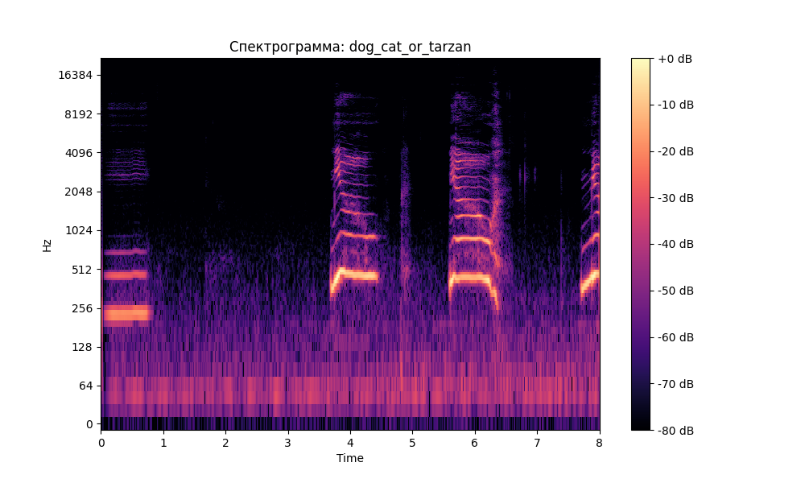

## Лабораторная работа №10. Обработка голоса

### Спектрограмма А

###  [A] Частотный диапазон: от 43.1 Гц до 3165.4 Гц
###  [A] Основной тембральный тон: 279.9 Гц
###  [A] Форманты: 538.3, 861.3, 1119.7 Гц

### Спектрограмма И

###  [И] Частотный диапазон: от 43.1 Гц до 4392.8 Гц
###  [И] Основной тембральный тон: 301.5 Гц
###  [И] Форманты: 301.5, 409.1, 516.8 Гц

### Спектрограмма имитации мяуканья

###  [cat] Частотный диапазон: от 21.5 Гц до 1765.7 Гц
###  [cat] Основной тембральный тон: 236.9 Гц
###  [cat] Форманты: 236.9, 452.2, 882.9 Гц
