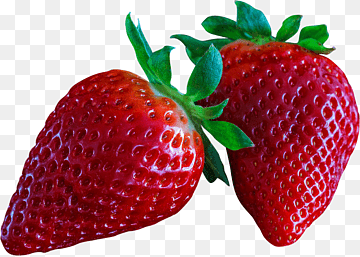

## Лабораторная работа №2. Обесцвечивание и  бинаризация растровых изображений
Вариант 32 (окно 7x7, Адаптивная бинаризация WAN)

1. Strawberry

|  |  |  |
|:-----------------------------------------:|:----------------------------------------------------:|:------------------------------------------:|
|                 original                  |                       semitone                       |                  binared                   |
  
 
2. Cartoon

|  |  |  |
|:-----------------------------------------:|:----------------------------------------------------:|:------------------------------------------:|
|                 original                  |                       semitone                       |                  binared                   |

3. Tiger

|  |  |  |
|:-----------------------------------------:|:----------------------------------------------------:|:------------------------------------------:|
|                 original                  |                       semitone                       |                  binared                   |

4. Person

|  |  |  |
|:-----------------------------------------:|:----------------------------------------------------:|:------------------------------------------:|
|                 original                  |                       semitone                       |                  binared                   |

5. Rentgen

|  |  |  |
|:-----------------------------------------:|:----------------------------------------------------:|:------------------------------------------:|
|                 original                  |                       semitone                       |                  binared                   |