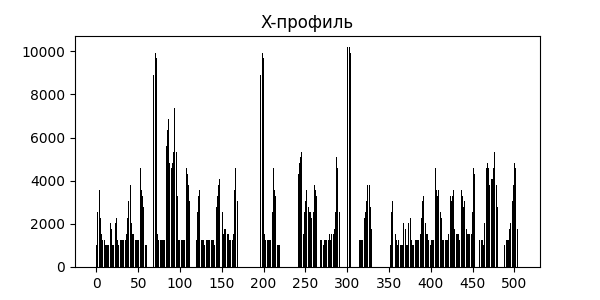
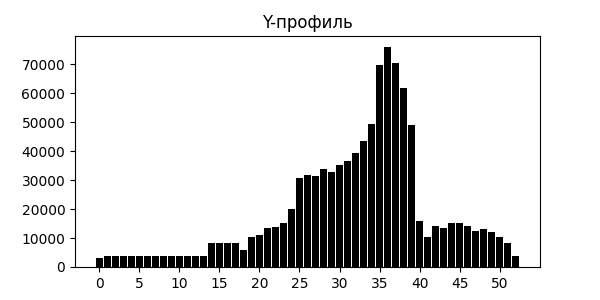
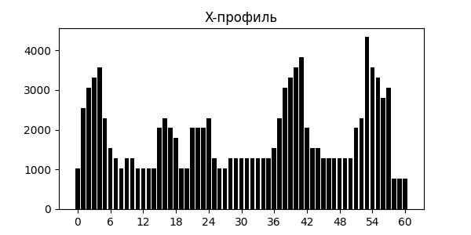
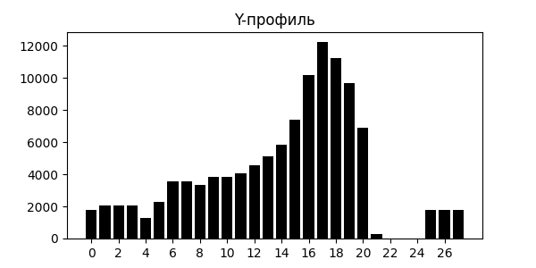

## Лабораторная работа №6. Сегментация текста 

Вариант с персидским алфавитом

### 1. Фраза на персидском

### 2. Горизонтальный и вертикальный профили соответственно

### 3. Массив с координатами обрамляющих символы прямоугольников

### 4. Профили символов персидского алфавита.

