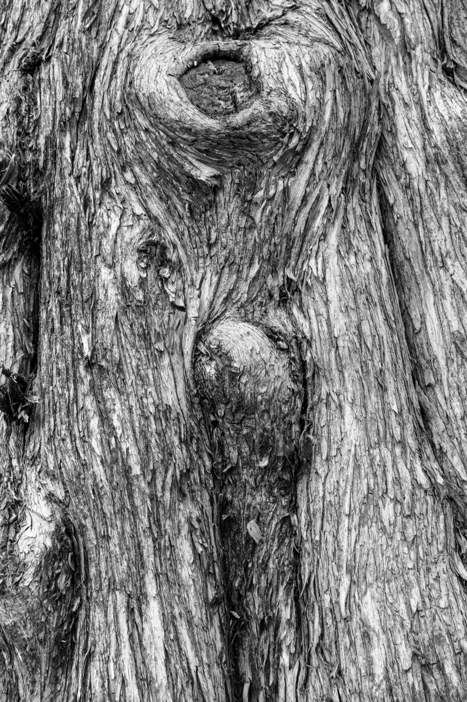

## Лабораторная работа №8. Текстурный анализ и контрастирование

### 1. Текстура дерева. Исходные, полутоновые и контрастированные полутоновые изображения

### 2. Текстура дерева. Гистограммы яркости исходных и контрастированных изображений

### 3. Текстура дерева. Матрицы для исходных и контрастированных изображений

### Признаки
GLNU: 82639.78
RLNU: 16883530.05
GLNU (контрастированный): 84751.25
RLNU (контрастированный): 16324770.20

### 4. Текстура кирпича. Исходные, полутоновые и контрастированные полутоновые изображения

### 5. Текстура кирпича. Гистограммы яркости исходных и контрастированных изображений

### 6. Текстура кирпича. Матрицы для исходных и контрастированных изображений

### Признаки
GLNU: 5655.26
RLNU: 535071.32
GLNU (контрастированный): 5817.98
RLNU (контрастированный): 514964.22

### 7. Текстура джинс. Исходные, полутоновые и контрастированные полутоновые изображения

### 8. Текстура джинс. Гистограммы яркости исходных и контрастированных изображений

### 9. Текстура джинс. Матрицы для исходных и контрастированных изображений

### Признаки
GLNU: 276804.24
RLNU: 20610101.86
GLNU (контрастированный): 284994.35
RLNU (контрастированный): 19723010.71