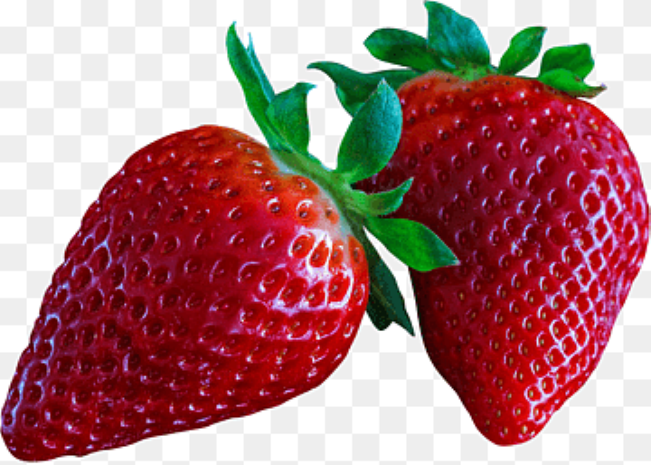

## Лабораторная работа №1. Цветовые модели и передискретизация изображений

1. Strawberry

- Сохранение отдельных каналов

|  |   |       |   |
|:-----------------------------------------:|:------------------------------------------------------------------:|:-----------------------------------------------------------------------------:|:-----------------------------------------------------------------------:|
|                 original                  |                            red_channel                             |                                 green_channel                                 |                              blue_channel                               |

- Яркостная компонента, инвертированная яркостная компонента и конвертация из RGB в HSI

|  |  |  |
|:-------------------------------------------------------------:|:-------------------------------------------------------------------------------:|:---------------------------------------------------------------:|
|                      intensity                                |                           inverted_intensity                                    |                           rgb_to_hsi                            |

- Интерполяция в M раз, децимация в N раз, передискретизация изображения в K=M/N раз, передискретизация изображения в K раз за один проход

|  |  |  |  |  |
|:-----------------------------------------:|:-------------------------------------------------------------------------------:|:-------------------------------------------------------------------------------:|:---------------------------------------------------------------------------------------------------------:|:-----------------------------------------------------------------------------------------------------------:|
|                 original                  |                              bilinear_resized_M=2                               |                              bilinear_resized_N=3                               |                                               resized_M/N                                                 |                                                resized_K=1.5                                                |

2. Tiger

- Сохранение отдельных каналов

|  |  |              |           |
|:------------------------------------:|:-------------------------------------------------------:|:------------------------------------------------------------------:|:------------------------------------------------------------------:|
|               original               |                       red_channel                       |                           green_channel                            |                            blue_channel                            |

- Яркостная компонента, инвертированная яркостная компонента и конвертация из RGB в HSI

|   |  |   |
|:----------------------------------------------------:|:---------------------------------------------------------------------:|:------------------------------------------------------:|
|                      intensity                       |            inverted_intensity                                         |                       rgb_to_hsi                       |

- Интерполяция в M раз, децимация в N раз, передискретизация изображения в K=M/N раз, передискретизация изображения в K раз за один проход

|   |  |  |   |  |
|:--------------------------------:|:---------------------------------------------------------------------:|:---------------------------------------------------------------------:|:------------------------------------------------------------------------------------------------:|:-------------------------------------------------------------------------------------------------:|
|             original             |                         bilinear_resized_M=2                          |                         bilinear_resized_N=3                          |                                           resized_M/N                                            |                                           resized_K=1.5                                           |
